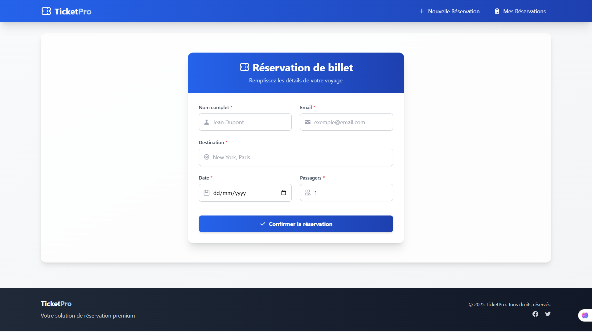
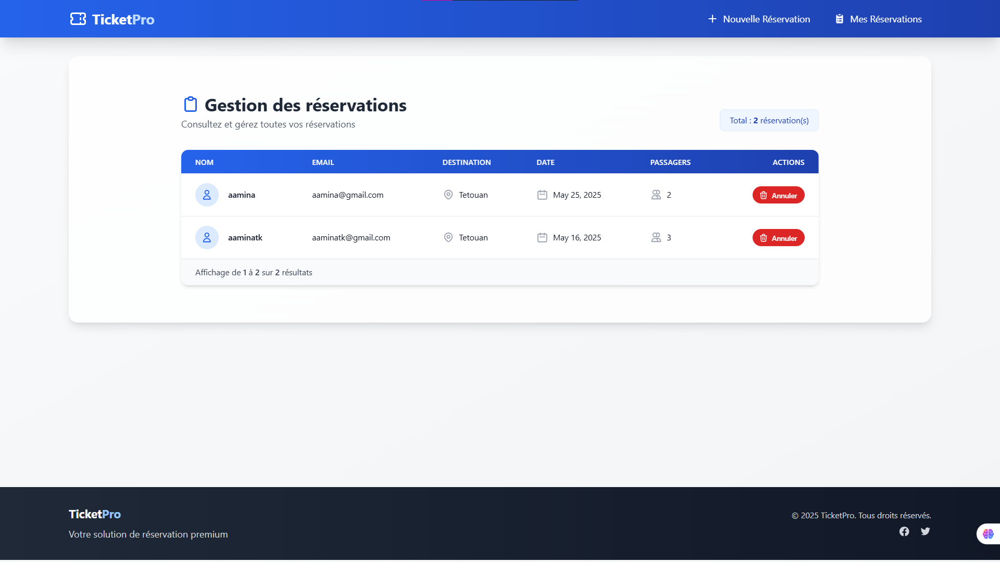

# 🎫 TicketReservationApp

Application Angular de réservation de billets avec stockage local et interface moderne.

## ✨ Fonctionnalités

- 🚀 Système complet de réservation de billets
- 📦 Stockage local avec IndexedDB via Dexie.js
- 🎨 Interface moderne avec Tailwind CSS
- 🔄 Fonctionnement hors ligne
- 📱 Design responsive
- 📊 Gestion des réservations
- ✅ Feedback visuel des actions

## 🛠 Technologies utilisées

- Angular 19
- Tailwind CSS 3
- Dexie.js (IndexedDB)
- TypeScript
- HTML5 / SCSS

## 🚀 Installation

1. **Cloner le dépôt** :
   git clone https://github.com/aaminatk22/Reservation_Billets.git
   cd ticket-reservation-app

2. **Installer les dépendances** :
    npm install

3. **Démarrer l'application** :
    npm run start
L'application sera disponible sur http://localhost:4200